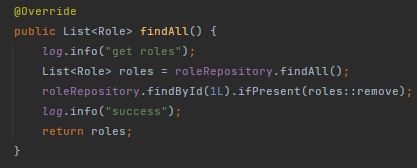
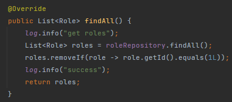
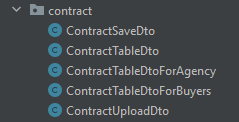

Роблю акцент на зрозумілому, простому, правильному, швидкому коді. Зменьшив кількість запитів в базу данних, де це можливо і де я знаю як це зробити

Наприклад такий код:

змінив на такий:

хочу зробити так щоб абсолютно всі запити і відповіді були dto, наприклад:

1. saveDto - обєкт який я отримую зі сторінки
2. tableDto - обєкт який я відправляю для заповнення таблиці квартир
3. uploadDto - обєкт який я відправляю для заповнення сторінки (input, select, img, etc)

