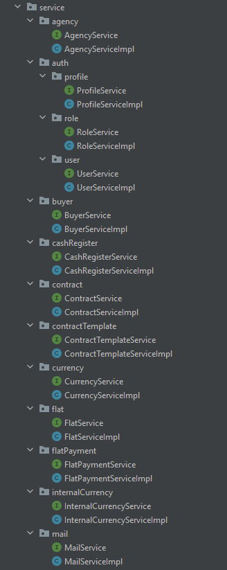
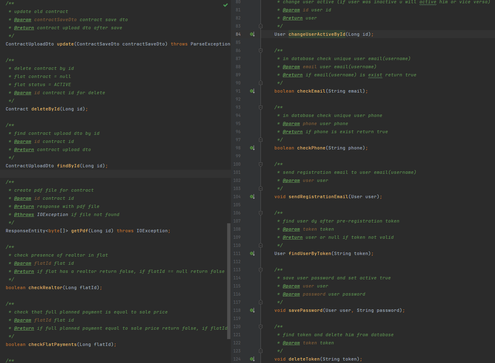
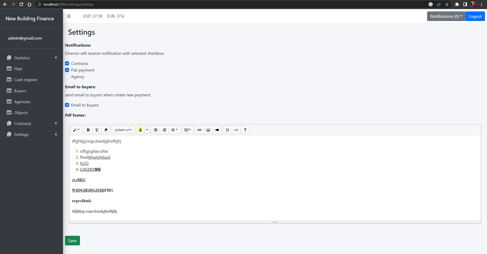
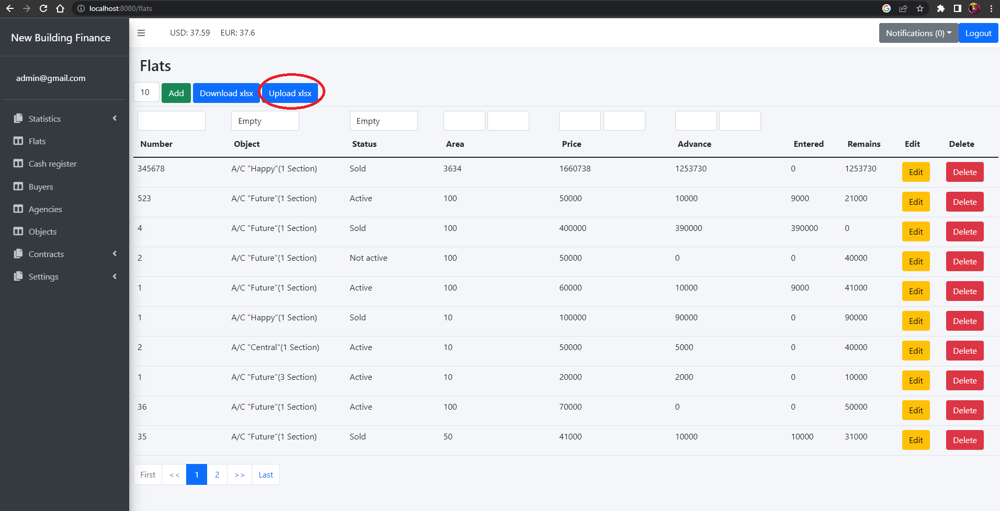
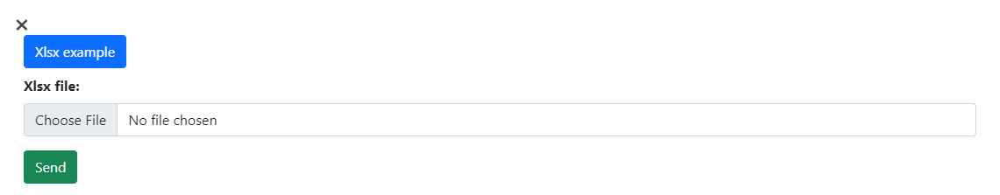
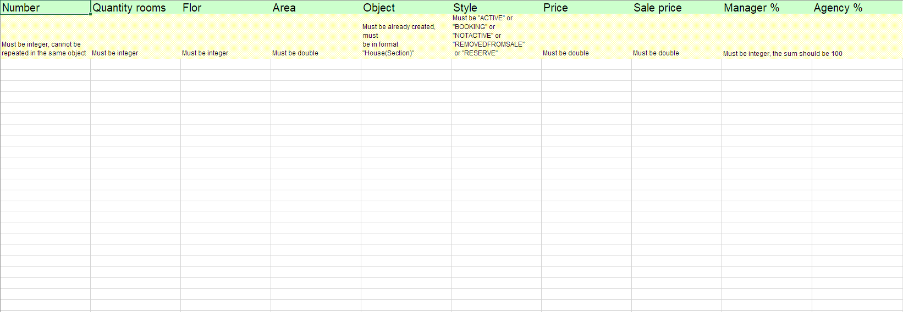
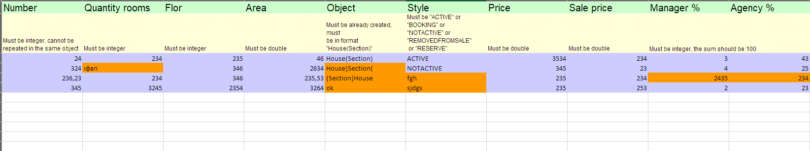

Роблю акцент на зрозумілому, простому, правильному, швидкому коді. Зменьшив кількість запитів в базу данних, де це 
можливо і де я знаю як це зробити

Наприклад такий код:

змінив на такий:

хочу зробити так щоб абсолютно всі запити і відповіді були dto, наприклад:

1. saveDto - обєкт який я отримую зі сторінки
2. tableDto - обєкт який я відправляю для заповнення таблиці квартир
3. uploadDto - обєкт який я відправляю для заповнення сторінки (input, select, img, etc)

До всіх сервісів доробив інтерфейси, бо раніше їх не було

В багатьох інтерфейсах до сервісів описані коментарі, пізніше допишу до всіх:

З нового:

1. Зробляна сторінка налаштувань

можна вимкнути або ввімкнути повідомлення директору при створенні або оновленні контрактів та агенства, та щоденне 
надсилання повідомлення якщо в людей є борги по оплаті квартири
2. На сторінці квартир добавлена кнопка завантажити exel(upload xls)

можемо отримати шаблон xlsx документа, тут розписано як потрібно заповнювати дані

по цьому шаблону ми заповнюємо дані і надсилаємо їх на сервер, якщо якісь дані заповнені не правильно, нам прийде файл 
flatsWithErrors з виділеними полями в яких є помилки, їх треба виправити і ще раз надіслати на сервер

